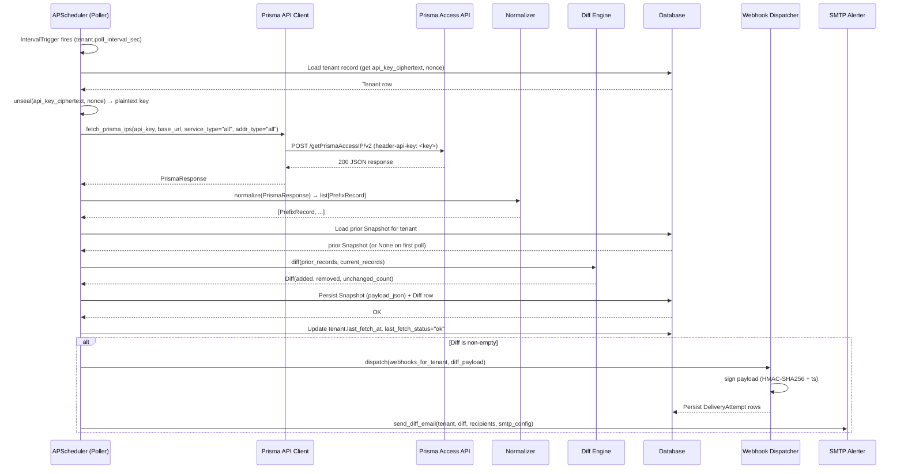

# PAIC Architecture

Prisma Access IP Console is composed of four cooperating layers that run within a single Python process (or across two processes when using external Postgres). This document describes each layer, their interfaces, and the end-to-end poll-and-dispatch flow.

---

## Layers

### 1. Web / API (FastAPI + React)

Entry point: `src/paic/api/main.py`

- Hosts the FastAPI application that serves the REST API under `/api/`.
- Serves the pre-built React + Vite + Tailwind static bundle at `/` (mounted as a `StaticFiles` directory after `npm run build`).
- Exposes `/healthz` (liveness) and `/readyz` (readiness: DB reachable + scheduler running).
- Exposes `/metrics` (Prometheus text exposition).

Responsibilities:
- CRUD for tenants, profiles, webhooks.
- On-demand export (`GET /api/reports/export`): applies filters, runs the summarization engine, passes output to the requested renderer.
- Diff history (`GET /api/tenants/{id}/diffs`).
- All API keys and secrets leave the API layer only as AES-GCM ciphertext; the plaintext is unsealed in memory only when the Poller needs to call Prisma.

### 2. Poller (APScheduler per-tenant)

Entry point: `src/paic/scheduler/poller.py`

- Registers one `IntervalTrigger` job per active tenant at `tenant.poll_interval_sec` (minimum 300 s, default 900 s, maximum 86 400 s).
- Each tick: unseal the tenant API key, call the Prisma Access API client, normalize the response into `PrefixRecord` objects, compute a diff against the prior `Snapshot`, persist both to the DB, and hand off to the Notifier.
- On HTTP 429 from Prisma: skip the current tick, set `last_fetch_status = "rate_limited"`, and let the scheduler fire again at the next natural interval.
- On all other errors: set `last_fetch_status = "error:<class>"`, increment `paic_poll_failures_total`.

### 3. Notifier (Webhook + SMTP)

Entry points: `src/paic/notifier/webhook.py`, `src/paic/notifier/smtp.py`

- Receives a non-empty `Diff` from the Poller.
- **Webhook dispatcher**: POSTs a JSON payload to each configured webhook URL for the tenant. Signs each request with `X-PAIC-Signature: sha256=<hex>` (HMAC-SHA256 over the canonical JSON body + Unix timestamp). Retries up to five times on failure (0 s, 60 s, 300 s, 900 s, 3 600 s). Persists each `DeliveryAttempt` row.
- **SMTP alerter**: Sends a `multipart/alternative` email (text/plain + text/html) to each configured recipient listing added and removed prefixes grouped by service type.

### 4. Database (Postgres 15 / SQLite 3.40+)

ORM: SQLAlchemy 2 (async engine).

| Table | Purpose |
|---|---|
| `tenant` | Tenant config: encrypted API key, poll interval, last fetch status |
| `snapshot` | Full prefix payload per tenant per fetch |
| `diff` | Added / removed / unchanged counts per fetch cycle |
| `profile` | Reusable aggregation + format + filter presets |
| `webhook` | Per-tenant webhook URLs and HMAC secrets (encrypted) |
| `delivery_attempt` | Per-webhook delivery log (status code, attempt index, error) |

---

## Sequence Diagram: Poll and Dispatch



---

## Data Flow Diagram

```
Browser / API client
        │
        ▼
  FastAPI (port 8080)
  ├── /api/*         ←── CRUD, export, diff history
  ├── /              ←── React SPA (static)
  ├── /healthz
  ├── /readyz
  └── /metrics
        │
        ▼
  SQLAlchemy (async)
  ├── Postgres 15     (docker-compose / managed DB)
  └── SQLite 3.40+    (single-container default)

APScheduler
  └── per-tenant IntervalJob
        ├── httpx → Prisma Access API (outbound HTTPS)
        ├── Diff Engine
        └── Notifier
              ├── httpx → Webhook URLs (outbound HTTPS)
              └── aiosmtp → SMTP relay (outbound)
```

---

## Module Layout

```
src/paic/
├── api/
│   └── main.py          # FastAPI app, router registration, static mount
├── core/
│   ├── settings.py      # pydantic-settings: PAIC_* env vars
│   ├── crypto.py        # AES-GCM seal / unseal
│   └── filters.py       # apply_filters(records, FilterSpec)
├── db/
│   ├── engine.py        # async engine + session factory
│   └── models.py        # SQLAlchemy ORM models
├── clients/
│   └── prisma.py        # async httpx client, PrismaResponse, error classes
├── aggregation/
│   └── engine.py        # summarize(): exact/lossless/budget/waste modes
├── renderers/
│   ├── csv.py
│   ├── json.py
│   ├── xml.py
│   ├── edl.py
│   ├── yaml.py
│   └── plain.py
├── scheduler/
│   └── poller.py        # APScheduler job registration + poll logic
└── notifier/
    ├── webhook.py       # HMAC-signed dispatch, retry, DeliveryAttempt
    └── smtp.py          # multipart/alternative email
```

---

## Key Design Decisions

| Decision | Rationale |
|---|---|
| Single process (scheduler + API in same Python runtime) | Simplifies Phase 1 deployment: one container, no message broker. Multi-replica scheduler leader election is a Phase 2 concern. |
| Field-level AES-GCM encryption for API keys | Secrets at rest are never plaintext in the DB. The master key lives only in the environment. |
| APScheduler (in-process) over Celery/Redis | Reduces operational surface area. Works with both SQLite and Postgres without a separate broker. |
| netaddr for all IP math | Handles IPv4, IPv6, and CIDR arithmetic uniformly without reinventing merge logic. |
| Async SQLAlchemy + httpx | Prevents scheduler ticks from blocking API request handling. |
